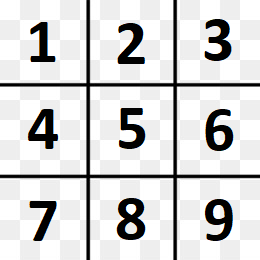
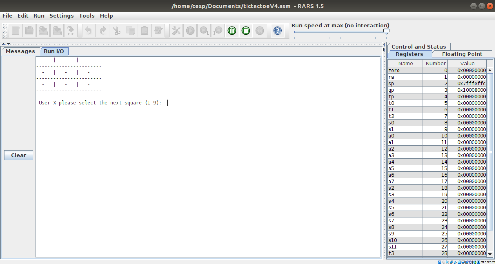

# CESP Programming Project TicTacToe

Simple overview of use/purpose.

The Project is a game of TicTacToe which can be played by two players. The game runs on the consol, or morse specific on the Run I/O in RARS.

## Authors

Jannik Rasch

## Demo Video

Replace -h3eH4ubuno in the this .md by your YT video

## Description

An in-depth paragraph about your project and overview of use.

The TicTacToe grid is displayed on the console after every turn. The '-' on the grid marks an emty square. The 'X' and the 'O' marks a square thats occupied by Player X or Player O.

The numbers 1 to 9 are related to the squares counting up from 1 to 9 from the top left square to the bottom right square.

The game follows the regular rules of TicTacToe. That means that the Players place their symbol in a free square on the 3x3 grid. To win the game the Player needs three squares in a row, column or diagonal line. If no Player wins before all nine squares are occupied the game ends with a draw.

There are a few rules when choosing the square. The square thats choosed can't be occupied by a Player and the entered number has to be in the range of 1 to 9. If one of the rules gets violated the player has to enter a new number in the console.

### How to run

To play the game you have to run the tictactoeV4.asm in RARS. If you run the program Player X starts with choosing a square. The Players choose the square by entering a number between 1 and 9 into the console when they are asked to.

Player X and O are choosing squares until a winner or draw is determined. After that the Players can choose wether they want wo play again or if they want to end the program. If a 1 is entered in the console the grid gets cleared and the game starts again. If a 0 is entered the program ends.

## Files
Describe the content of each file of your application: e.g.

src/tictactoeV4.asm

test/unittest_tictactoe_X /..._O / ..._D # 9 unit tests for the three possible outcomes of a game

## Test
Screenshot that shows succedded (unit) tests 
