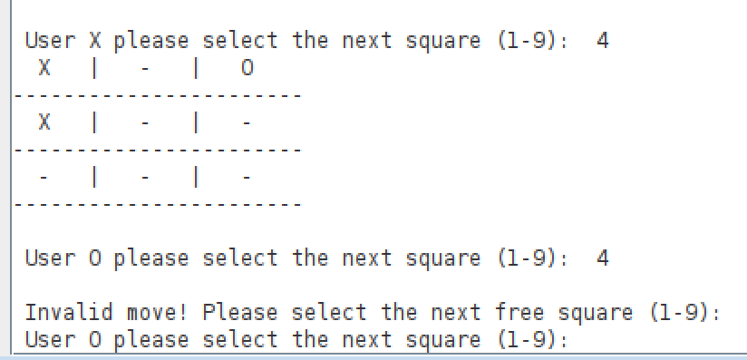
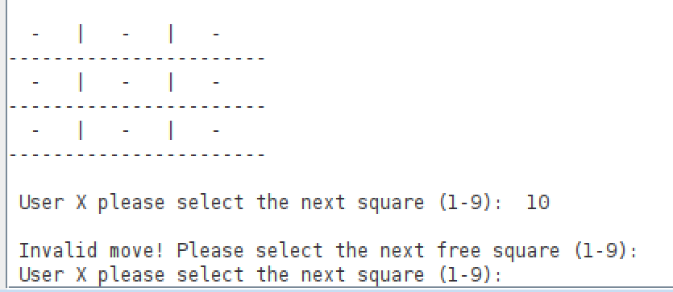
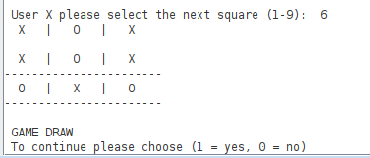
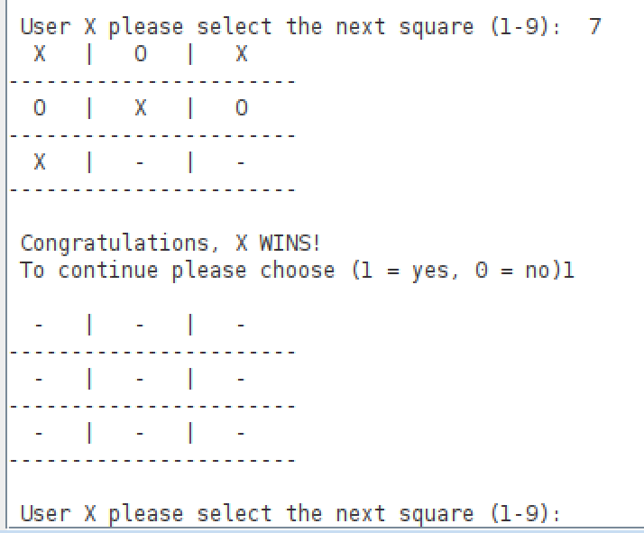
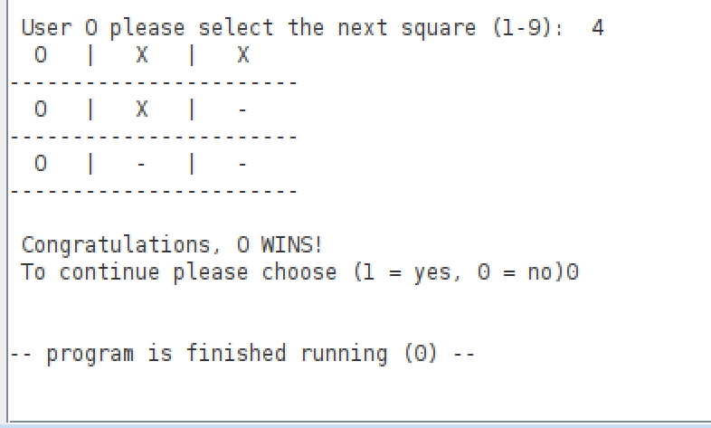
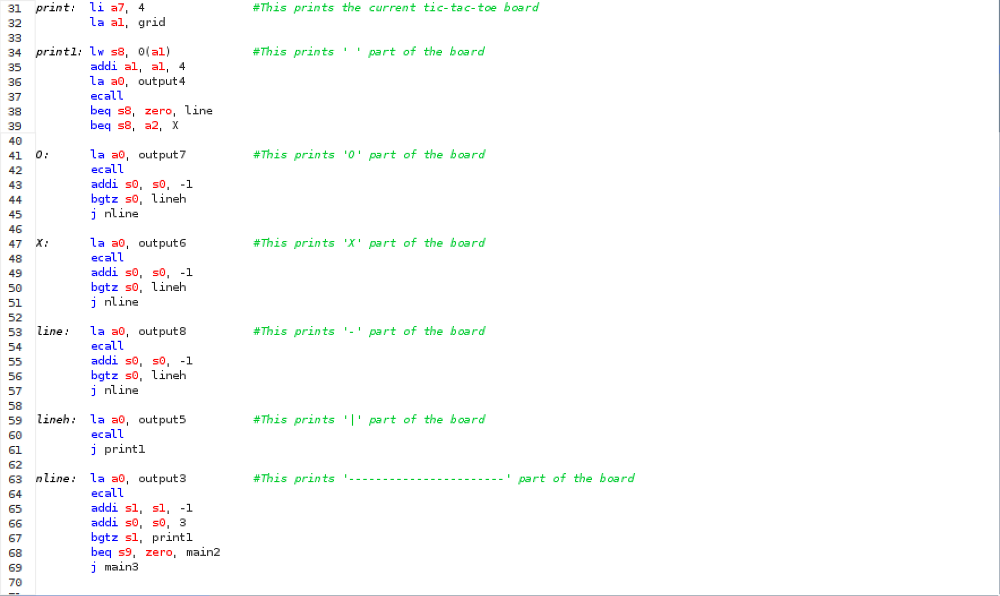
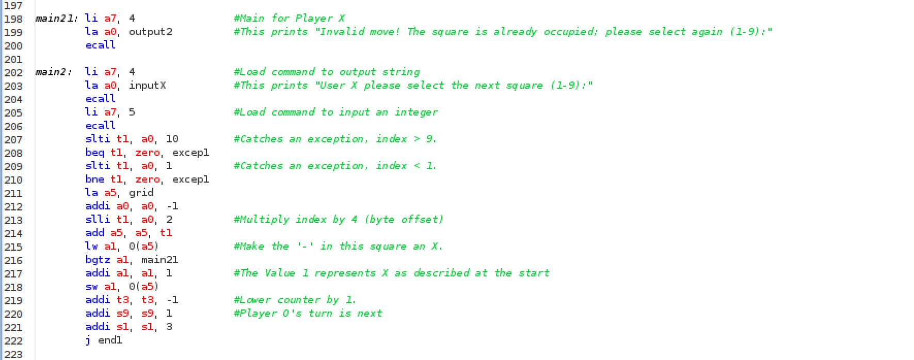

# CESP Programming Project TicTacToe

Simple overview of use/purpose.

The Project is a game of TicTacToe which can be played by two players. The game runs on the consol, or morse specific on the Run I/O in RARS.

## Authors

Jannik Rasch

## Demo Video

Replace -h3eH4ubuno in the this .md by your YT video

## Description

An in-depth paragraph about the project and overview of use.

The TicTacToe grid is displayed on the console after every turn. The '-' on the grid marks an emty square. The 'X' and the 'O' mark a square thats occupied by Player X or Player O.

The game follows the regular rules of TicTacToe. That means that the Players place their symbol in a free square on the 3x3 grid. To win the game the Player needs three squares in a row, column or diagonal line. If no Player wins before all nine squares are occupied the game ends with a draw.

The Players select a square by relating to it by its number.
The numbers 1 to 9 are related to the squares counting up from 1 to 9 from the top left square to the bottom right square.

  

There are a few rules when choosing the square. The selected square can't be occupied by a Player and the entered number has to be in the range of 1 to 9. If one of the rules gets violated the player has to enter a new number in the console.

  

  

The program announces the winner or a draw as soon as Player X or Player O wins or all squares are filled without a winner. The Players are asked to choose whether they want to remach or if they want to exit the game and end the program. Those options are selected by entering a 1 or a 0 in the console. 

  

Entering a 1 restarts the game. That means that the grid gets reset to '-' in all sqaures and the program jumps back to the start of the game. Entering a 0 ends the game and the program. If you want to play another game after this you have to run the program again. The following images show what happens when a 1 or 0 is enterd in the console.

  

  

### Program

The values in the grid are stored in a array. The value 1 represents the X and the value 2 represents the 2.

The grid gets build out of seperated parts. Such parts are the horizontal lines ' | ' or the vertical lines '---'. The values stored in the array are printed in between the lines as X or O. The stored values are accesed by loading the word at the corresponding part of the array (in steps by 4).
The image shows the function that prints the grid on the console.

  

There are three very similar functions that print the grid when X wins, O wins or they draw. They also print the fitting winning message and let the program jump to the part where the players are asked whether they want to restart or end the game.

In the program are two mains. One for Player X and one for Player O. Those ask the Player to input a number of a square and store a 1 or 2 (X or O) in the corresponding part of the array. If a number out of range from 1 to 9 is entered in the console or if theres allready a 1 or 2 (X or O) in the selected square (part of the array) the program jumps to another part of the main ehich is irectly above it. The player is asked to input a new valid number.

  

### How to run

To play the game you have to run the tictactoeV4.asm in RARS. If you run the program Player X starts with choosing a square. The Players choose the square by entering a number between 1 and 9 into the console when they are asked to. For the best experience maximise the console.

  

## Files
Describe the content of each file of your application: e.g.

src/tictactoeV4.asm

test/unittest_tictactoe_X /..._O / ..._D # 9 unit tests for the three possible outcomes of a game

## Test
Screenshot that shows succedded (unit) tests 
