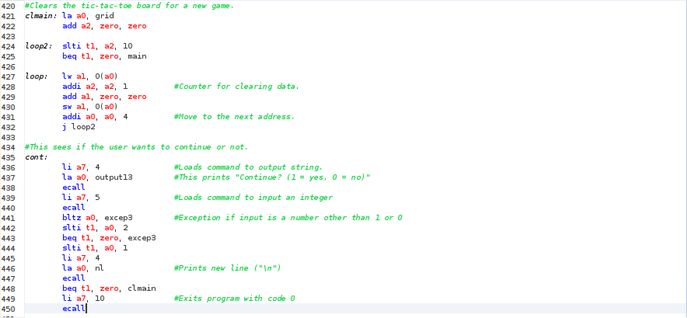
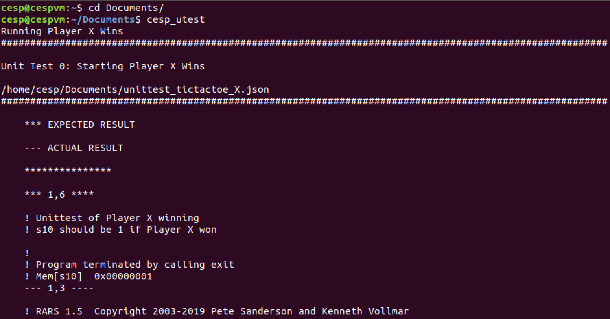
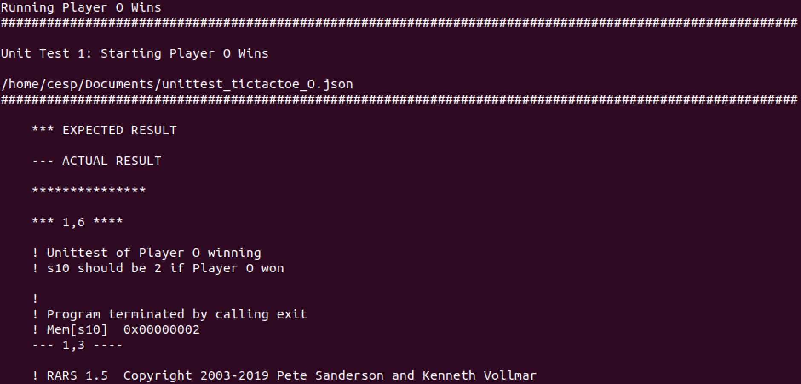
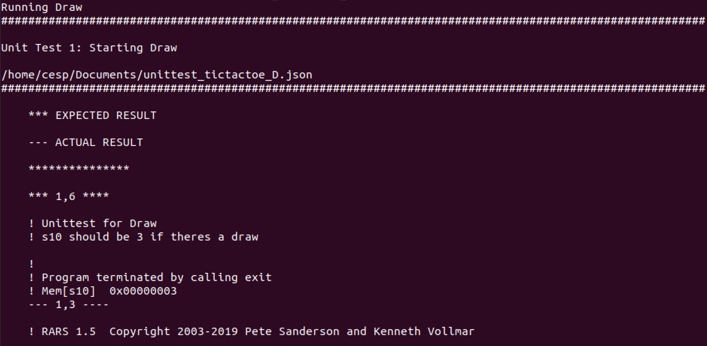

# CESP Programming Project TicTacToe

Simple overview of use/purpose.

The Project is a game of TicTacToe which can be played by two players. The game runs on the consol, or morse specific on the Run I/O in RARS.

## Authors

Matrikelnummer: 1824595

Email: inf20180@lehre.dhbw-stuttgart.de

## Demo Video

## Description

An in-depth paragraph about the project and overview of use.

The TicTacToe grid is displayed on the console after every turn. The '-' on the grid marks an emty square. The 'X' and the 'O' mark a square thats occupied by Player X or Player O.

The game follows the regular rules of TicTacToe. That means that the Players place their symbol in a free square on the 3x3 grid. To win the game the Player needs three squares in a row, column or diagonal line. If no Player wins before all nine squares are occupied the game ends with a draw.

The Players select a square by relating to it by its number.
The numbers 1 to 9 are related to the squares counting up from 1 to 9 from the top left square to the bottom right square.

  

There are a few rules when choosing the square. The selected square can't be occupied by a Player and the entered number has to be in the range of 1 to 9. If one of the rules gets violated the player has to enter a new number in the console.

  

  

The program announces the winner or a draw as soon as Player X or Player O wins or all squares are filled without a winner. The Players are asked to choose whether they want to remach or if they want to exit the game and end the program. Those options are selected by entering a 1 or a 0 in the console. 

  

Entering a 1 restarts the game. That means that the grid gets reset to '-' in all sqaures and the program jumps back to the start of the game. Entering a 0 ends the game and the program. If you want to play another game after this you have to run the program again. The following images show what happens when a 1 or 0 is enterd in the console.

  

  

### Program

The values in the grid are stored in a array. The value 1 represents the X and the value 2 represents the O.

The grid gets build out of seperated parts. Such parts are the horizontal lines ' | ' or the vertical lines '---'. The values stored in the array are printed in between the lines as X or O. The stored values are accesed by loading the word at the corresponding part of the array (in steps by 4).
The image shows the function that prints the grid on the console.

  

There are three more very similar functions that print the grid when X wins, O wins or they draw. They also print the fitting winning message and let the program jump to the part where the players are asked whether they want to restart or end the game.

In the program are two mains. One for Player X and one for Player O. Those ask the Player to input the number of a square and store a 1 or 2 (X or O) in the corresponding part of the array. If a number out of range from 1 to 9 is entered in the console or if theres allready a 1 or 2 (X or O) in the selected square (part of the array) the program jumps to another part of the main which is directly above it. The player is asked to input a new valid number.

  

At the end of each main after a player selected a square an his symbol is stored in the array the program jumps to the end functions. These two function determine if one of the players wins. Both of them work identical. The squares of each row, column and diagonal are compared. For the comparison the values of the array are loaded into registers and are compared with the values 1 and 2 (X and O). The image shows a part of the end function for Player X.

  

A draw is determined if Player X doesnt win after the 9th turn. The reason for that is that Player X makes the first and the last turn. Because of that he has to win if the game runs until the 9th turn or there is a draw.

The program jumps to mentioned print functions that print the grid and the result of the game. From there it jumps to the part where the players can deside whether they want to play again or end the game.

The function cont (continue) asks the players to enter either a 1 or a 0 in the console to make a descision. If a number other than 1 or 0 is entered the players are asked to enter a valid number. If a 1 is entered the program jumps to the funcion clmain (clearmain) which clears the grid and jumps to the start of the game after that. If a 0 is entered the program ends with the exit ecall.

  

### How to run

To play the game you have to run the tictactoeV4.asm in RARS. If you run the program Player X starts with choosing a square. The Players choose the square by entering a number between 1 and 9 into the console when they are asked to. For the best experience maximise the console.

  

## Files

src/tictactoeV4.asm - The tictactoe game

test/unittest_tictactoe_X (.asm and .json) - Unittest to test if Player X wins with a set grid

test/unittest_tictactoe_O (.asm and .json) - Unittest to test if Player O wins with a set grid

test/unittest_tictactoe_D (.asm and .json) - Unittest to test if thers a draw with the set grid

## Test
Screenshot that shows succedded (unit) tests 

  

  

  

